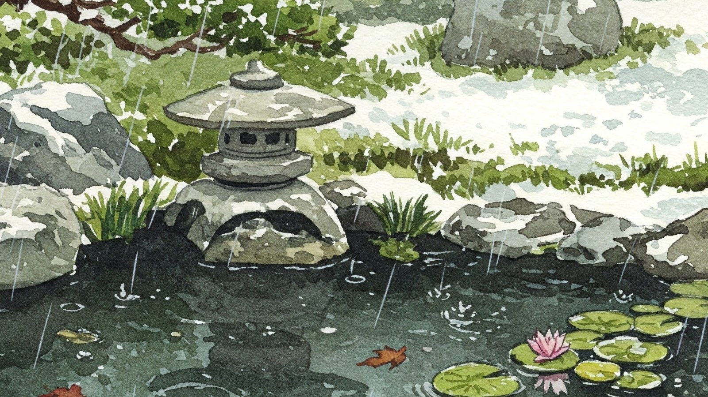

# 雨水

- 今日は雨水（うすい）、天からの降水が雪から雨に変わりゆくころ、らしいんだけど、今まで知らなかった。二十四節気の中でもレアカードね！
- この機会に節気の一覧表を探してみたら次のサイトがトップに出てきた。
- [国立国会図書館/日本の暦/暦の中のことば/二十四節気](https://www.ndl.go.jp/koyomi/chapter3/s7.html)
- さすが国会図書館なんでもあるな。
