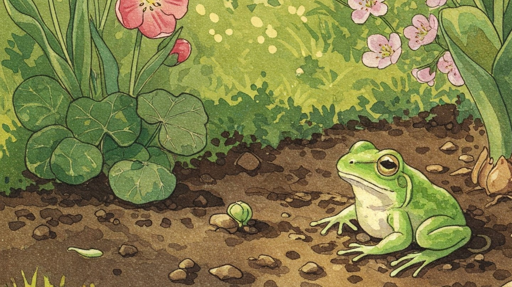

# 啓蟄
	
- 今日は啓蟄だった。そろそろ虫も外に出てくる季節とのこと。
- ここで言う虫とは「地を這うもの」の総称だろう。ミミズだってオケラだってアメンボだって虫である。

+ ミミズとヒルは同じ環形動物だが、なぜかミミズは人気があるね。土壌を肥やすらしいし。
+ それに対してヒルは人間に害をなすらしい…、って、おいCopilot何書いてるんだ、医療用のヒルもいるんだぞ。

- 実はこないだエディタに GitHub Copilot を入れたら、なんだか妙なサジェストしてくるのである。
- あ、いまも「**GitHub Copilot**」まで書いたら「**が助けてくれることがある**」とか自画自賛してきた。
- いいから AI はちょっと黙ってて。
