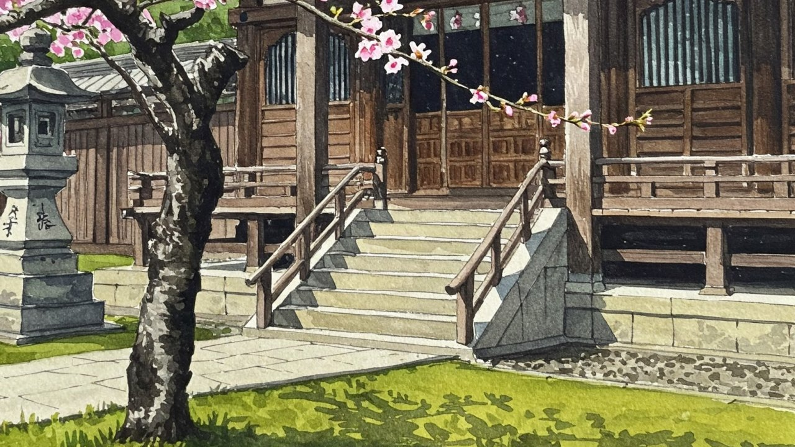

# 春分
	
- 今日は春分の日。春の彼岸の中日なので墓参りに行った。
- お寺の墓地はいっぱいの人出で、知らない家の子供らがはしゃいでいた。まあ昔から子供にとって墓参りは遠足みたいなもんだ。
- 境内の桜はまだ咲いていなかった。予想では東京の開花宣言は明後日（3月22日）らしい。
- でも光はすっかり春だった。せっかくなのでAIイラストにもちょこっと桜を入れてみた。これがないと何の季節のイラストかわからない。
