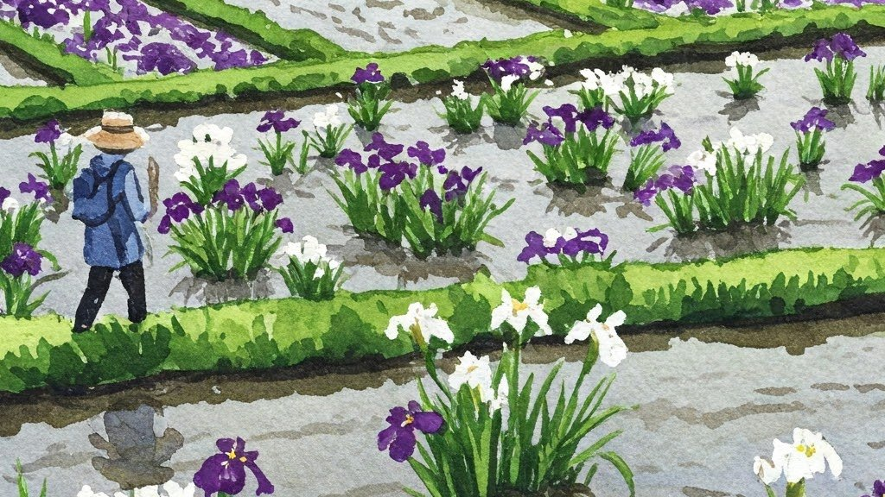

# 立夏
	
+ 今日は二十四節気の立夏（りっか）である。
+ 暦の上では、今から夏、という重要な区切りの日だが、立冬や立春に比べるとなんとなく影が薄い。
+ なぜならこの時期には強力なライバルがいるから。そう、５月５日といえば「端午の節句」である。子供の日で、鯉のぼりで、菖蒲湯である。
+ この辺のスーパーにも「菖蒲湯に入りましょう！」とか書かれて菖蒲の葉っぱ売ってるからな。今日は立夏だとか思ってる人はあまりいないと思う。
+ 東京の堀切菖蒲園って知ってますか。今ごろ行くと花菖蒲のいろいろな品種が咲いてきれいなんすよ。今回のサムネもそんな感じにした。
+ というわけで結局、端午の節句の話しか書いてない。立夏はどこへ。