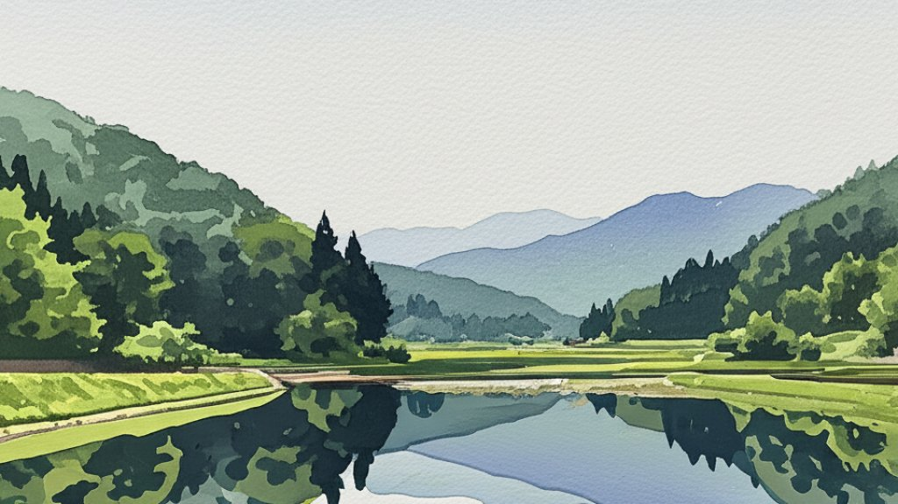

# 小満

- 今日は二十四節気の小満（しょうまん）である。万物が生長して、天地に満ち始める季節だそうな。
- 二十四節気には「小寒/大寒」「小暑/大暑」のように２つ組のものが多いが、小満に対する「大満」はない。
- これがなぜかと考察するに、おそらく大満だと、満ち切った状態、いわば「成長の終わり」を感じさせるからだ。縁起が悪いね！
- あれですよ、おみくじの「大吉」が敬遠されたり、東照宮の逆柱と同じ理屈。
- 完成より途上をたっとぶ、いにしえの東洋の叡智だ。こういうの考える思想家は老人じゃなくて青年だろうな！青々しくていいね！