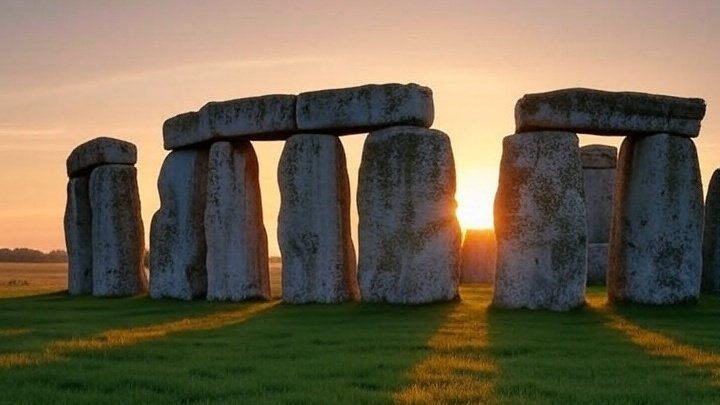

# 夏至

- 本日は夏至（げし）である。二十四節気の中でもトップクラスの存在感だ。世界中で夏至を祝っている。
- たとえばサムネの英国ストーンヘンジでは夏至に石の間から昇るご来光を拝むらしい。
- 北欧とかの夏至祭りも有名だ。高緯度の国々では夏至はありがたい存在なんだろう。
- いっぽう最近の日本では、あまり夏至を祝う感じはない気がする。
- これ夏至の「げ」の音のイメージが悪いんじゃないか。「し」って音もなんか湿っぽい。
- もっとこうサワヤカな名前にすれば、人気が出ると思う。
 