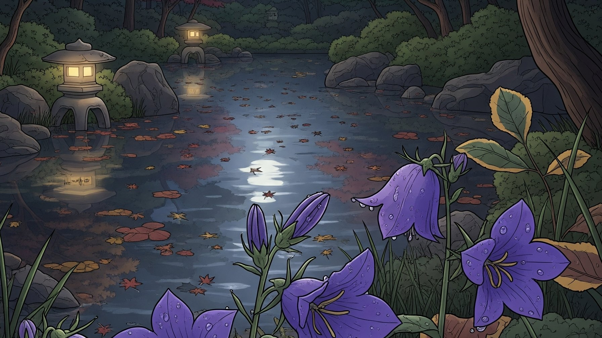

# 立秋

- 昨日は二十四節気の「立秋」だった。
- 連日の猛暑の中、どこが秋なんだという感じではあるが、SNSではヒグラシの声が聞こえたり、
  秋の虫が鳴き始めたとのレポートが散見された。やっぱり秋なのか。

+ 立秋っぽいイラストをAIに発注するため、まず「立秋の花って何？」と聞いてみたら桔梗らしい。
  そこで「夜の日本庭園に桔梗」を描いてもらったのが今回のサムネである。
+ あれ桔梗ってこんな花だっけか。
  なんか桔梗とリンドウがごっちゃになっているんですよねー。
+ あとリンドウとスズランも間違えて覚えているっぽい。
  漢方薬になるのがリンドウで、毒だから馬も食べないのがスズランだっけ？