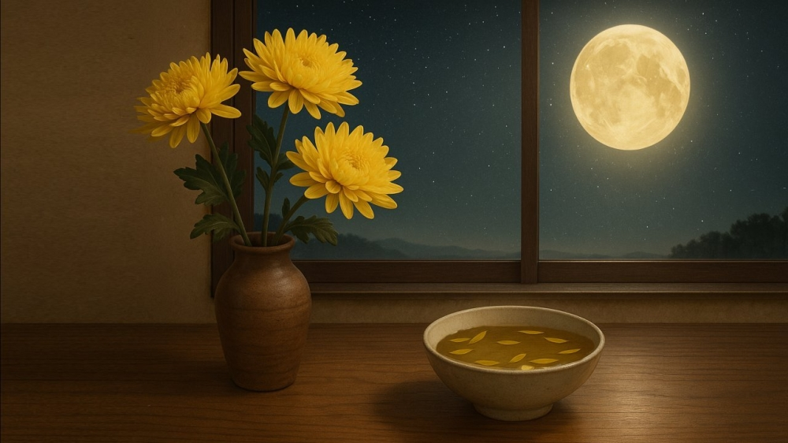

# 白露

- 本日は二十四節気の白露（はくろ）である。「まだ日中は暑いものの朝晩めっきり涼しくなり草木が露を結ぶ季節」らしい。
- いわれてみると今朝などはかなり涼しく、庭の花も濡れていた。まあ露ではなくて台風の余波で少し雨が降ったものらしいが。
- この季節をあらわす花は何？とAIに聞いたが「秋の花全般」とかしか言わない。うーむ、なら9月9日（重陽の節句）も近いし、今回のサムネは菊にするか。
- そうだ盃に花びらを浮かべて菊酒とかいいんじゃね。ほら「白露」ってなんか日本酒のブランドっぽいじゃん。
- ぐああサムネの盃が洗面器ぐらいでかくなっちゃった。 なのでこれは盃ではなく、花びらを浮かべた水盤ということにする。