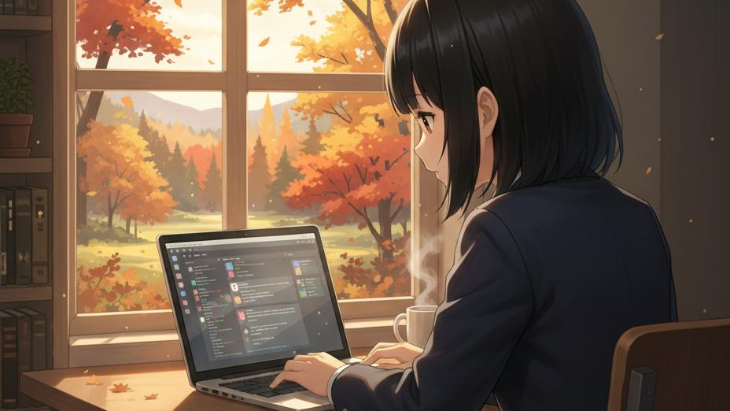

Google Gemini にイラストを発注するとき、自画像を添付したら、それをもとに描いてくれました！

これがウワサの Nao Banana エンジンですか！？

注文：
 
次の設定でイラストを描いてください

* <イラスト設定>
* 　<タイトル>秋の窓辺で作業する少女</タイトル>
* 　<人物>
* 　　<参照画像>添付した女の子の画像</参照画像>
* 　</人物>
* 　<人物のポーズ>
* 　　机の前で椅子に座り、猫背になって画面を見つめ、PCを操作している
* 　</人物のポーズ>
* 　<撮影位置>
* 　　女の子の斜め後ろから、PCディスプレイと、窓の風景が見える位置
* 　</撮影位置>
* 　<窓の外の光景>
* 　　窓の外には秋の自然の風景が広がっている
* 　　室内には、光が柔らかく差し込んでいる
* 　</窓の外の光景>
* </イラスト設定>

添付画像：

生成結果：

