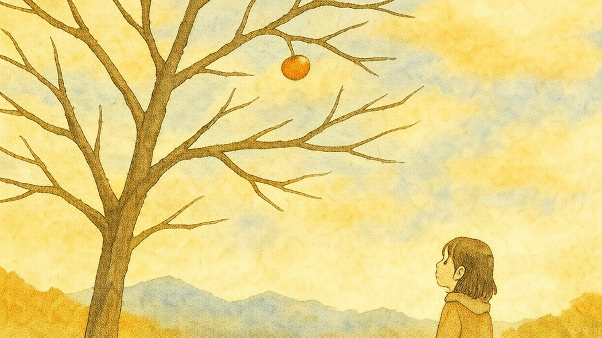

# 霜降

* 10月23日は二十四節気の霜降（そうこう）だった。朝晩はもう寒い。

- 近所の家に甘柿の木があり、毎年20個ぐらい分けてくれる。今年も頂いたので食った旨かった。そういう季節。
- ちなみに10月26日は「柿の日」だ。なぜなら正岡子規が「柿食えば」の句を詠んだのがこの日だからだ。

* そこで今回のサムネは木守り柿。知ってますか柿の実は、全部とらずに木にひとつだけ残しておくんだよ。
