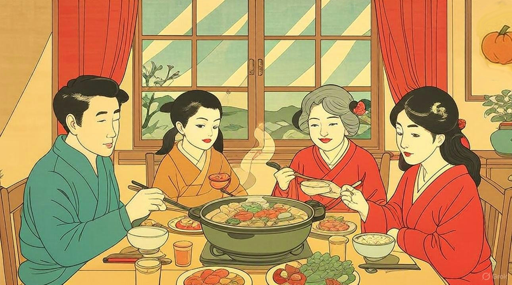

# 大雪

* 12月7日は二十四節気の大雪（たいせつ）だった。ここ埼玉も朝晩は凍えるようでいつ初雪が降っても不思議じゃない。
* こんな季節のおいしい料理は何？とAIに聞いたら「大根と鶏肉の煮物」をすすめられた。

1. 大根と鶏もも肉を一口大に切ります。
2. 鍋にごま油をひき、鶏肉を炒め、色が変わったら大根を加えます。
3. だし汁、醤油、みりん、砂糖で味を調え、大根が柔らかくなるまで煮ます。

* いつか作ってみよう。
