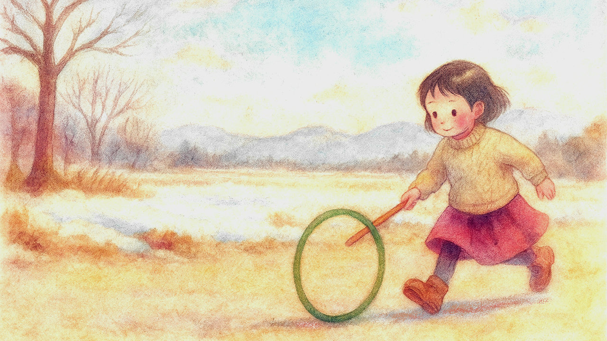

# 冬至

* 12月22日は冬至（とうじ）である。今日から次第に昼間が長くなる。
* 正確には、夜明けの時刻はまだしばらく1月7日頃まで遅くなり続けるのだが、それ以上に日没も遅くなるので、差し引き昼間が長くなるらしい。
* このへんの事情をAIに聞くと、「均時差」とかの専門用語を交えてねっとり説明してくれるが、まあ覚えなくていいと思った。

* あ、でも均時差により太陽が描く軌跡をアナレンマというのは覚えた。
* なんか語呂がよくないですか「アナレンマ」。口に出して読みたい日本語のひとつである。
* まあアナレンマの語源はギリシャ語らしいけど（ジレンマやトリレンマと同じ）。
