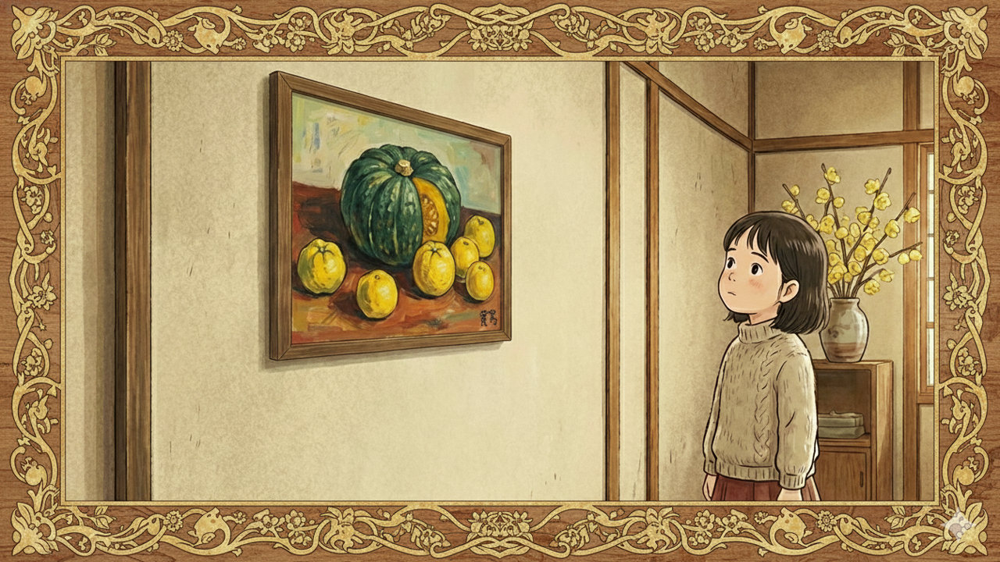

# 冬至

* 12月22日は冬至（とうじ）である。今日から次第に昼間が長くなる。
* 正確には、夜明けはまだ1月7日頃まで遅くなり続けるのだが、それ以上に日没も遅れるので、差し引き昼間が長くなるらしい。
* このへんの事情をAIに聞くと、「均時差」とかの専門用語を交えてねっとり説明してくれる。まあ覚えなくていいです。

+ あ、でも均時差により太陽が描く軌跡を「アナレンマ」というのは覚えた。
+ 語呂がよくないですか「アナレンマ」。口に出して読みたい日本語のひとつである。
+ まあアナレンマの語源はギリシャ語だけど（ジレンマやトリレンマと同じ）。

* 今回のサムネは、冬至っぽい題材として、「南瓜」と「柚子」と「蝋梅」でなにか描いてとAIに依頼した。なんかシチュエーションがよくわからないのは仕様である。