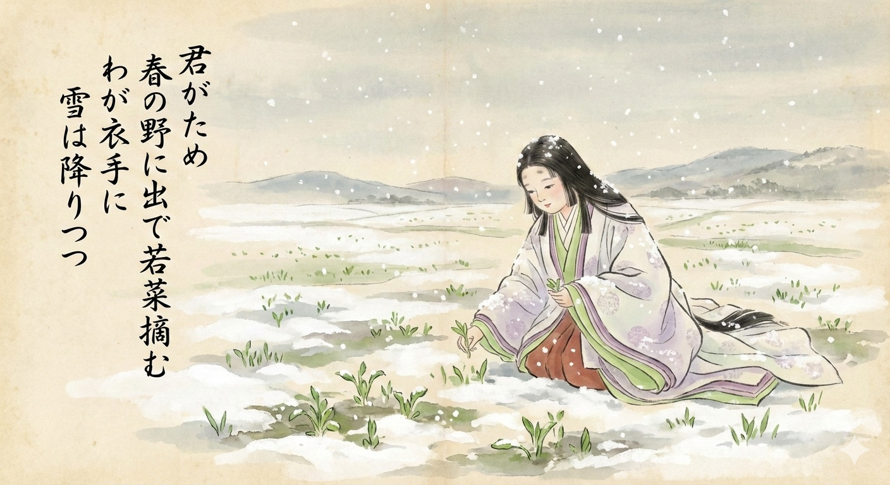

# 小寒

* 1月5日は小寒（しょうかん）だった。いわゆる「寒の入り」で、ここから本格的に寒くなるらしい。
* だが本日1月7日は「春の七草」を食す日でもある。もう春は近い。そんな季節でもあるわけですよ。
* 「冬来たりなば春遠からじ」って誰の言葉だっけ。調べたらイギリスのシェリーの詩だった。
* If Winter comes, can Spring be far behind ? -- Shelley
* そういや百人一首にもそんな感じの和歌があったね。ということで今回のサムネは雪の野で若菜を摘む少女です。
