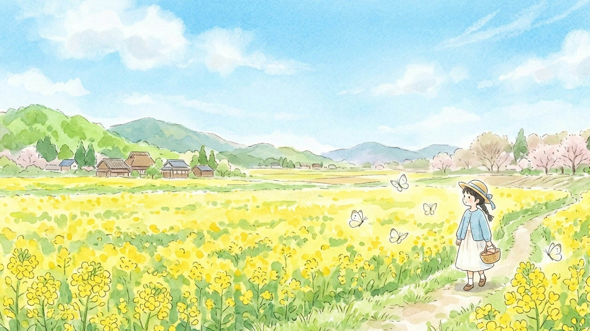

# 啓蟄

- 3月5日は二十四節気の啓蟄（けいちつ）である。
- 七十二候でいうと啓蟄の初候だから、蟄虫啓戸（すごもりむし戸をひらく）である。
- この日だけは虫を温かい目で見られる気がする。

- それで思い出したが、ネットミーム「そうだったらいいなって」「ふーん君は絵がうまい」の虫って、
みんなわりと嫌いじゃないよね？
- ディズニーのアリスの芋虫にイメージが似てるというか、あんまりキモくない。
- というか嫌悪の対象はケムシであって、実はイモムシってあまり嫌われてないのでは？
- 誰かXでアンケートをとってほしい。

